Hi! Let me show you this interesting project.

I think of myself as more of a fine joinery type of guy but I have found myself a few times in the lucky position to be the guy nearest to the big carpentry that needs doing - I'm definitely not complaining. 

So this shed / barn had a gap in the siding / fascia / facade which let rain in and caused the upright to rot inside. 

OK sorry these pictures are way too big - fix this later!

You may be able to see the structural screws I've added to hold frame together while I'm working where the wood is still good.

After standing and staring at the project for a while, I decided to do a large half lap joint.
There was just enough wood left to do a 5:1 length to thickness ratio. The end cut was extremely difficult to make, I probably spent 90 minutes trying to get a comfortable and safe position (that wasn't possible). Anyway as you can see it came out square and true.

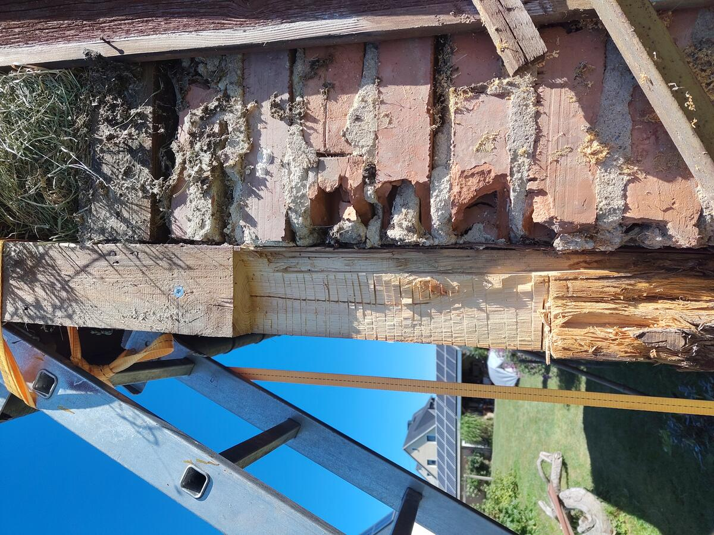

A few more cuts and some overhead chisel work later...

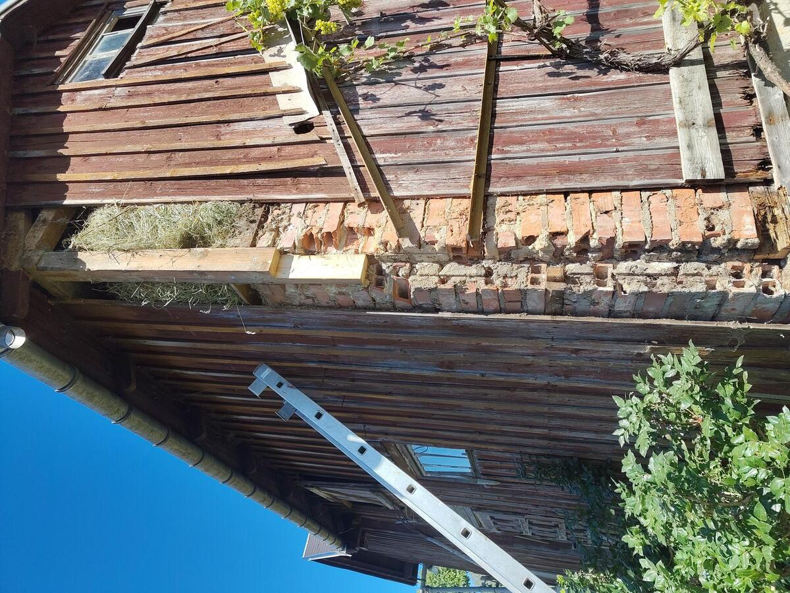

A 12*12cm by two meters pine post and a trip to the sawmill... well so far the materials cost for this project could be counted in stuff that was laying around, and it's pretty nice if you can keep it that way.

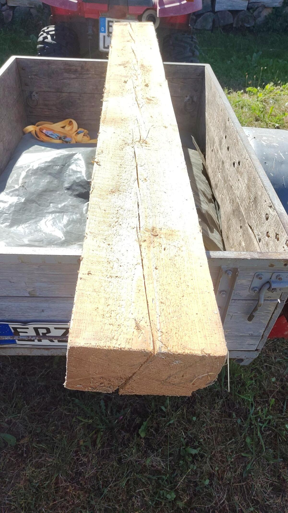

I used some freshly powdered chalk and the string from my plumbline, ('cause my snapline was elsewhere) to mark the cuts. My Makita 190mm circular saw has a max cut depth of about 65mm so that meant a cut on each side, staying square, leaving a bit of extra on the back cut and then planing off the step. Happily, I knew from experience that I was going to be working with old, twisted and warped stock so I was ready and had the plane with me. One day I hope to hew beams from freshly cut trees but this will do for now.

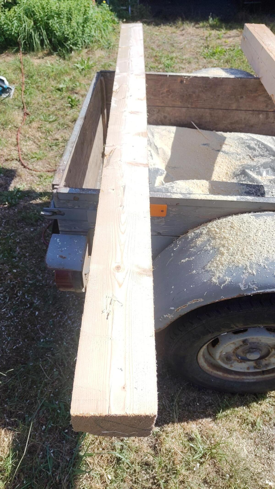

It came out super good, something about cutting wood in the sunshine puts me in a zen-like state. I swear I can feel my grandfather watching approvingly.
Um, you can't really see it in the picture, but the surface of the saw cut was quite interesting - well if you enjoy thinking about how saw cuts, which we can assume you do if you're here. Basically so I am not a machine and will not cut perfectly straight, there will be corrections, the ideal would be a very low amplitude sine wave with perfectly even marking in the cut surface, and it was a pretty even wobble. I love that saw, of course later it got a really indulgent oven cleaner on the blade and the silbergleit on the base and blade. Better than new!

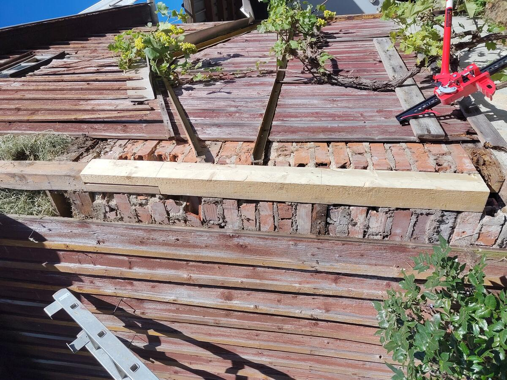

So this is a half lap joint of course, nice and big, there's also a mortise on the back of this piece about mid way down.

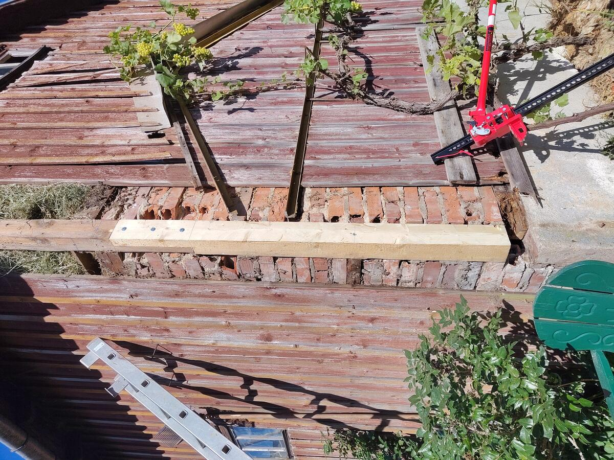

I would have preferred to through bold the pieces but screw and glue is plenty in this case. I am very happy with how tight that joint came out.

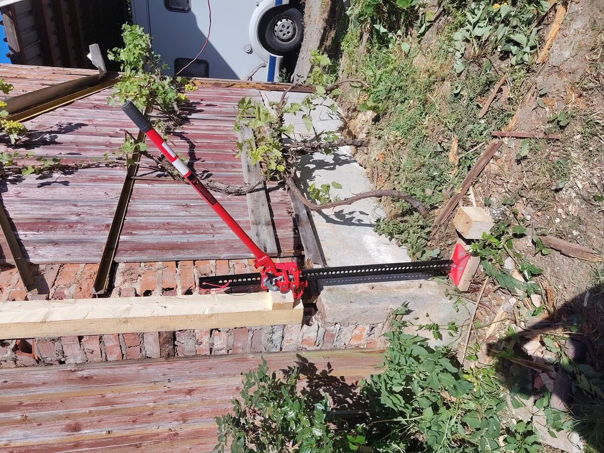

OK so obviously the weight of the roof and structure is being taken up ... somewhere? So I need to lift the whole barn and place it onto its new leg.
Obviously this is a good time to think about whether I've done everything correctly so far.

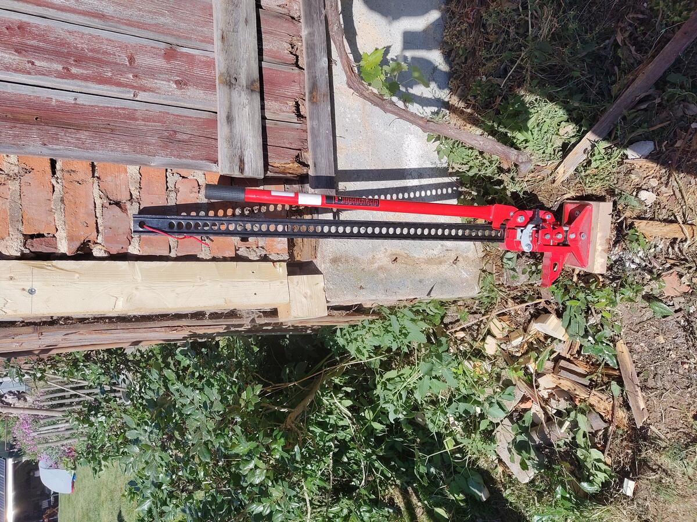

This block has the grain going horizontally so it doesn't soak up water and rot.
The farm jack / high lift jack was near to its limit. Obviously it has found its calling and is living the dream in this moment.

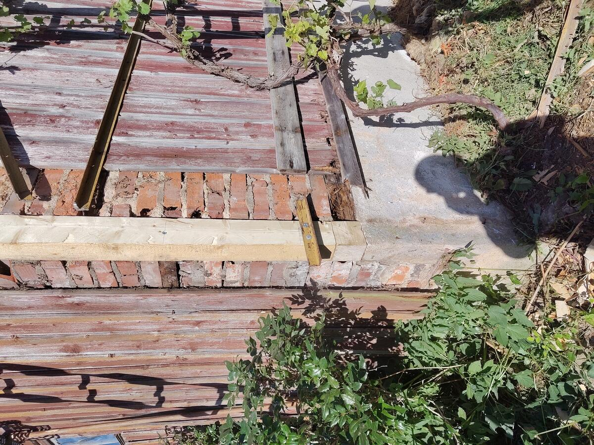

Here we go - so structure, many force.

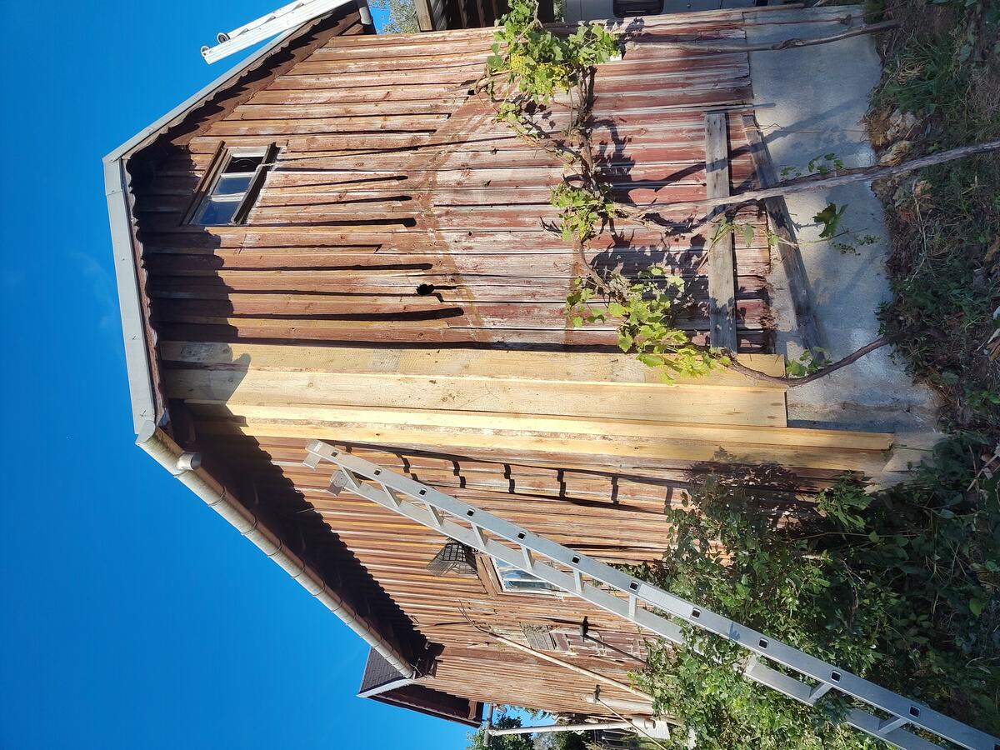
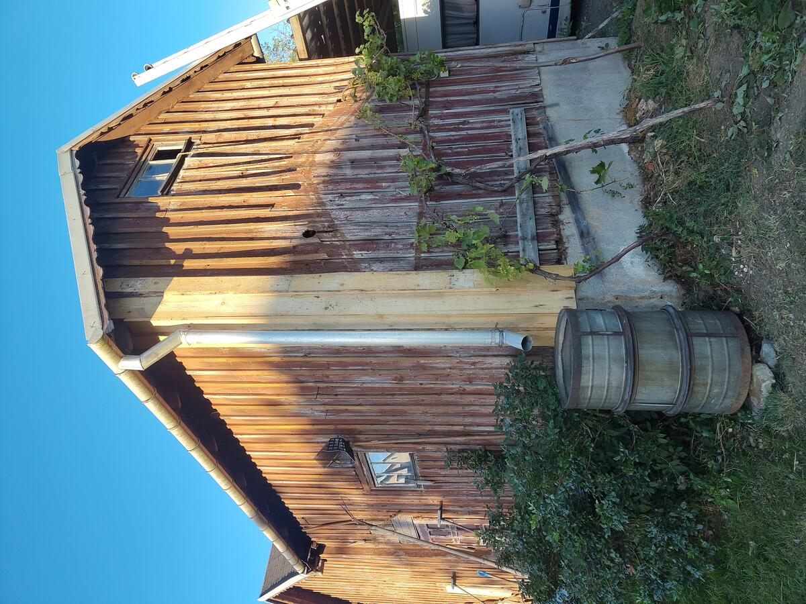

Job is a good one. 12 hours all up. Barn isn't going to fall down any time soon. The roof is pretty new and good, you don't see it in the pictures but it is absolutely worth saving.

Hope you enjoyed my story, that's how I solved this problem anyway.
